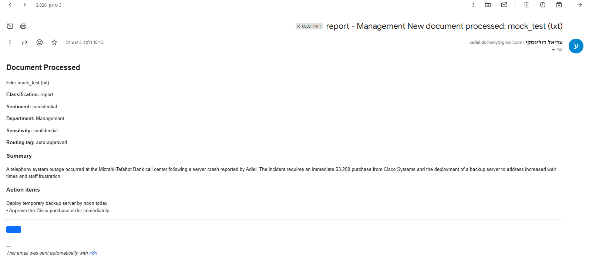
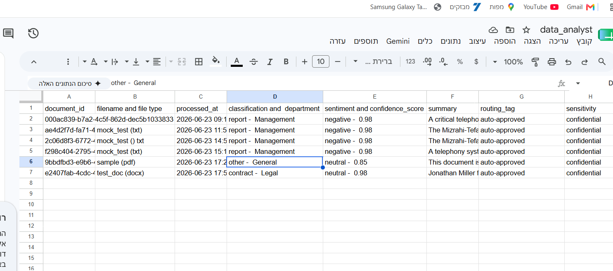
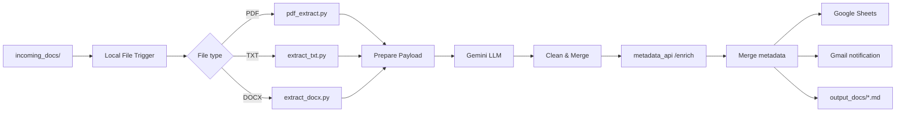

# Intelligent Analyst — Document Intelligence Pipeline

An automated document intelligence pipeline built with **n8n**, **Google Gemini**, and **custom Python extractors**. Drop a file into a watched folder and the system extracts text, analyzes it with an LLM, enriches metadata via a Flask API, and delivers structured output through Google Sheets, Gmail, and local Markdown files.





---

## Architecture



### Pipeline stages

| Stage | Component | Description |
|-------|-----------|-------------|
| **Ingestion** | n8n Local File Trigger | Polls `/incoming_docs` for new PDF, TXT, or DOCX files |
| **Extraction** | Python scripts in `scripts/` | Converts documents to normalized JSON: `file_name`, `file_type`, `text` |
| **AI inference** | Gemini (`gemini-3-flash-preview`) | Returns structured JSON: summary, classification, sentiment, entities, action items, confidence |
| **Enrichment** | `metadata_api` (Flask) | Adds `document_id`, department, sensitivity, routing tag, and adjusted confidence |
| **Output** | Sheets + Gmail + filesystem | Hybrid **Markdown + embedded JSON** summaries, email alerts, and spreadsheet audit log |

### Repository layout

```
intelligent_analyst/
├── docker-compose.yml      # n8n + metadata API stack
├── Dockerfile              # n8n image with Python extractors
├── Dockerfile.api          # Flask metadata enrichment service
├── requirements.txt        # Shared Python dependencies
├── .env.example            # Environment variable template
├── incoming_docs/          # Drop test documents here
├── output_docs/            # Generated *_summary.md files
├── scripts/
│   ├── pdf_extract.py      # PDF → JSON (PyMuPDF)
│   ├── extract_txt.py      # TXT → JSON
│   ├── extract_docx.py     # DOCX → JSON (python-docx)
│   └── metadata_api.py     # POST /enrich enrichment API
├── workflows/
│   └── Intelligent_Analyst.json
└── screenshot/             # Example pipeline outputs
```

---

## Prerequisites

- [Docker](https://docs.docker.com/get-docker/) **24+**
- [Docker Compose](https://docs.docker.com/compose/install/) **v2+**
- A [Google AI Studio](https://aistudio.google.com/) API key for Gemini
- (Optional) Google Cloud OAuth credentials for Gmail and Google Sheets

---

## Setup

### 1. Clone the repository

```bash
git clone https://github.com/<your-org>/intelligent_analyst.git
cd intelligent_analyst
```

### 2. Configure environment variables

```bash
cp .env.example .env
```

Edit `.env` and set a persistent encryption key (required for n8n credential storage):

```bash
# Linux / macOS / Git Bash
openssl rand -hex 32
```

Paste the output into `N8N_ENCRYPTION_KEY` in `.env`.

### 3. Build and start the stack

```bash
docker compose up -d --build
```

Verify both services are healthy:

```bash
docker compose ps
curl http://localhost:5000/health   # metadata API
```

Open n8n at **http://localhost:5678** and complete the first-time owner account setup.

### 4. Import the n8n workflow

1. In n8n, go to **Workflows** → **Add workflow** → **⋮** menu → **Import from File**.
2. Select `workflows/Intelligent_Analyst.json`.
3. Configure credentials on the nodes that require them:

   | Node | Credential type | Notes |
   |------|-----------------|-------|
   | Parse Gemini json | HTTP Header Auth or Gemini API | API key for `generativelanguage.googleapis.com` |
   | send a email | Gmail OAuth2 | Recipient address in the node parameters |
   | add row | Google Sheets OAuth2 | Point to your spreadsheet and sheet |

4. Update the **Google Sheets** node (`add row`) with your spreadsheet ID and column mapping.
5. Update the **Gmail** node (`send a email`) with your notification recipient.
6. **Activate** the workflow (toggle in the top-right).

> The workflow calls the metadata API at `http://metadata_api:5000/enrich` using Docker Compose service DNS. No `host.docker.internal` configuration is required.

---

## Testing

Sample files are included under `incoming_docs/`:

| File | Type |
|------|------|
| `mock_test.txt` | Plain text incident report |
| `sample.pdf` | PDF document |
| `test_doc.docx` | Word document |

### Run a test

1. Ensure the workflow is **active** and containers are running.
2. Copy or move a document into `incoming_docs/`:

   ```bash
   cp incoming_docs/mock_test.txt incoming_docs/my_run.txt
   ```

3. Watch execution in n8n (**Executions** tab).
4. Confirm outputs:
   - **Local file:** `output_docs/<filename>_summary.md` (Markdown header + embedded JSON block)
   - **Email:** Gmail notification with summary and action items (see screenshot above)
   - **Spreadsheet:** New row in your Google Sheet audit log

Generated files combine human-readable summaries with machine-readable JSON. See `output_docs/test_doc_summary.md` for a full example.

---

## Metadata API

The Flask service exposes endpoints used by the workflow and for manual testing:

| Method | Endpoint | Description |
|--------|----------|-------------|
| `GET` | `/health` | Health check |
| `GET` | `/categories` | Supported document categories |
| `POST` | `/sensitivity` | Compute sensitivity from classification + entities |
| `POST` | `/enrich` | Full metadata enrichment (used by n8n) |

Example:

```bash
curl -X POST http://localhost:5000/enrich \
  -H "Content-Type: application/json" \
  -d '{"classification":"invoice","confidence_score":0.9,"entities":{"people":["Jane Doe"]}}'
```

---

## Local Python development (optional)

To run extractors or the API outside Docker:

```bash
python -m venv .venv
source .venv/bin/activate        # Windows: .venv\Scripts\activate
pip install -r requirements.txt

python scripts/extract_txt.py incoming_docs/mock_test.txt
python scripts/metadata_api.py
```

---

## Operations

```bash
# View logs
docker compose logs -f n8n
docker compose logs -f metadata_api

# Restart after script changes (scripts are volume-mounted)
docker compose restart n8n

# Rebuild after Dockerfile or requirements changes
docker compose up -d --build

# Stop and remove containers (preserves n8n_data volume)
docker compose down
```

---

## Troubleshooting

| Symptom | Likely cause | Fix |
|---------|--------------|-----|
| Workflow does not trigger | Workflow inactive or wrong path | Activate workflow; trigger watches `/incoming_docs` inside the container |
| `Execute Command` fails | Python not in PATH | Rebuild n8n image: `docker compose up -d --build` |
| Metadata enrichment fails | API not reachable | Check `docker compose ps`; workflow URL must be `http://metadata_api:5000/enrich` |
| Empty extraction output | Corrupt or scanned PDF | Verify file opens locally; OCR is not included |
| Credentials lost on restart | Missing encryption key | Set `N8N_ENCRYPTION_KEY` in `.env` before first run |

---

## Security notes

- Never commit `.env` or API keys to version control.
- Replace placeholder OAuth targets (spreadsheet ID, email recipient) before production use.
- The metadata API is exposed on port `5000` for debugging; restrict access in production deployments.

---

## License

[MIT](LICENSE)
